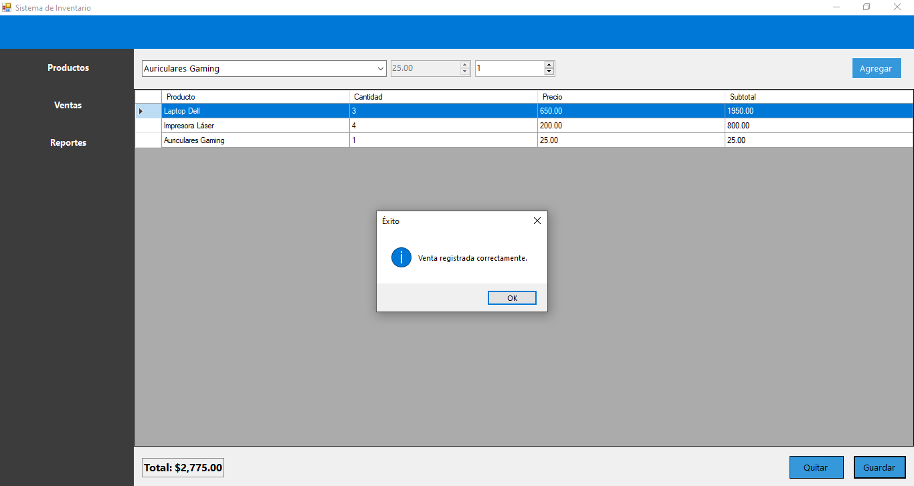
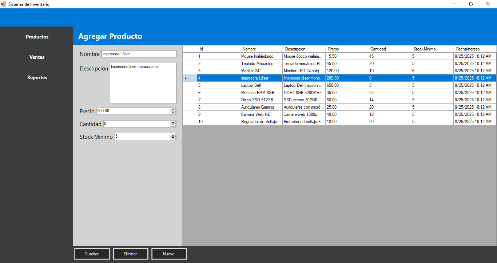

# Sistema de Inventario - WinForms (Proyecto Académico ITLA)

**Autor:** Reylin Lantigua
**Asignatura:** Programación II
**Institución:** ITLA  
**Año:** 2023(revisado 2024)  


## Descripción

Sistema de inventario desarrollado como práctica académica usando **Windows Forms** y **C#**.  
Permite gestionar productos, registrar ventas y generar reportes de manera sencilla.

**Funcionalidades principales:**

- CRUD completo de productos (Crear, Leer, Actualizar, Eliminar).  
- Control de stock en tiempo real.  
- Registro de ventas con cálculo automático del total.  
- Exportación de reportes de ventas a CSV.  
- Interfaz gráfica funcional en un solo formulario principal.  

>  Proyecto académico de práctica, no está pensado para producción.

---

## 🖼️ Capturas de pantalla

### Ventas


### Productos


### Reportes


---

## Tecnologías

- **Lenguaje:** C#  
- **Framework:** .NET Framework 4.6  
- **Base de datos:** SQL Server  
- **ORM:** Entity Framework 6  
- **IDE:** Visual Studio  


## Instalación y Ejecución

1. Clonar el repositorio:
> git clone https://github.com/ReylinLantigua/ControlStockWinForms.git

2. Abrir la solución `ControlStockWinForms.sln` en Visual Studio.
3. Restaurar los paquetes NuGet (Entity Framework).
4. Ejecutar el script `ScriptBaseDatos.sql` en SQL Server para crear la base de datos y tablas necesarias.
5. Ejecutar la aplicación desde Visual Studio (`F5`).


```

## Estructura del Proyecto


ControlStockWinForms/
│
├─ ControlStockWinForms.sln
├─ ControlStockWinForms/        # Proyecto principal
│  ├─ Controllers/              # Clases de acceso a datos
│  ├─ Models/                   # Modelos de datos
│  ├─ UI/Forms/                 # Formularios de la aplicación
│  ├─ bin/                      # Archivos compilados (ignorar en Git)
│  ├─ obj/                      # Archivos temporales (ignorar en Git)
│  └─ packages/                 # Paquetes NuGet (opcional ignorar)
└─ ScriptBaseDatos.sql           # Script SQL para crear la base de datos

```

## Uso

1. Agregar productos en la sección de inventario.
2. Registrar ventas seleccionando productos y cantidades.
3. Visualizar y exportar reportes de ventas en formato CSV.


## Licencia

Proyecto académico de práctica desarrollado en ITLA.
No está pensado para producción.

